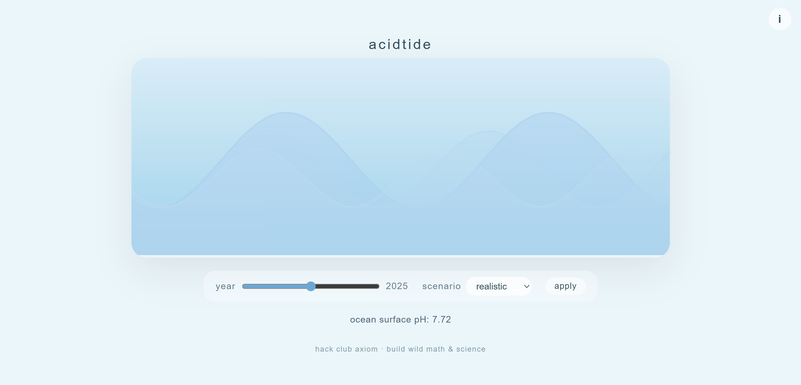

# acidtide

acidtide is an interactive ocean acidification simulation built with p5.js. It visualizes how the ocean's surface pH and wave behavior may change over time under different CO₂ emission scenarios.

## How it works

* **Year Slider:** Move the slider to select a year between 1950 and 2100.
* **Scenario Selector:** Choose between `optimistic`, `realistic`, and `severe` CO₂ emission scenarios.
* **Apply Button:** Press the button to update the simulation based on your selected year and scenario.
* **Ocean pH Display:** Shows the simulated surface pH for the current year and scenario.
* **Waves:** Multiple layered sine waves represent the ocean surface. The wave height, speed, and color change depending on the ocean pH to reflect increasing acidification.
* **Info Button:** Click `i` in the corner to learn about the science behind ocean acidification.

## Technical Details

* Built with [p5.js](https://p5js.org/) for canvas drawing and animation.
* Responsive design adapts to window width.
* Wave layers use sine functions for smooth motion, with amplitude and wavelength modulated by ocean pH.
* pH is calculated from CO₂ using a simple exponential growth model and converted to a constrained pH value.

## Credits

Developed for [Hack Club Axiom](https://axiom.hackclub.com/) 2025. Inspired by oceanography and climate science.
